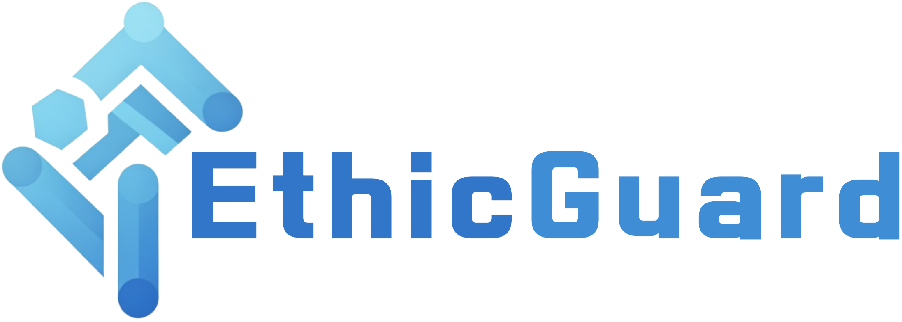
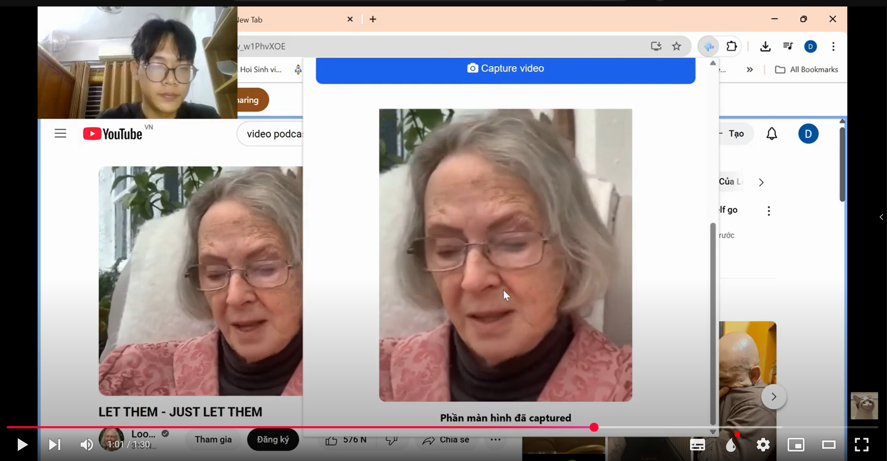
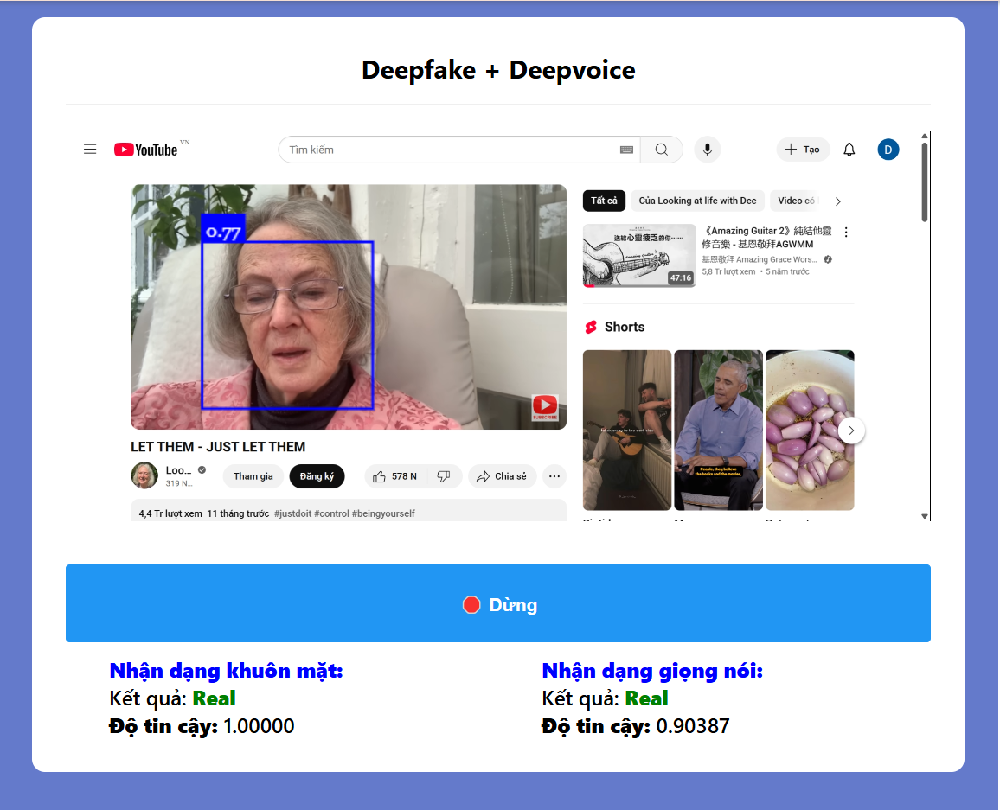

# EthicGuard: Detecting Deepfake and Deepvoice


## Project Overview

An extension application integrated into the browser, capable of detecting Deepfake (face forgery) and Deepvoice (voice forgery) with high accuracy and fast processing speed, capable of operating in real-time. When using, simply select a tab and highlight the video you want to check for forgery. The application will display the results on your screen, including information such as the percentage of the video/voice being fake and the model's conclusion.

## Contents:

- [Project Overview](#project-overview)
- [Contents](#contents)
- [Key Features](#key-features)
- [Demo](#demo)
- [Libraries](#libraries)
- [Core technology](#core-technology)
- [Implementation](#implementation)
- [Project Structure](#project-structure)
- [Experimental Results](#experimental-results)
- [Future Development](#future-development)
- [Team members](#team-members)

## Key Features

- **Deepfake Detection**: Identifies fake faces in images and videos
- **Deepvoice Detection**: Analyzes and detects fake voices
- **Browser Extension Interface**: Developed as an extension, capable of detecting fake conversations through online applications such as **Google Meet, Zoom, Microsoft Teams, Messenger video call, ...**

## Demo

<!-- [](./demo/demo-extension.mp4) -->
[](https://youtu.be/Kg-UCkpaw-E)

Click the image above to watch the demo video on YouTube.


## Libraries

- Python: Main programming language for the project
- NumPy: Handles multi-dimensional arrays for image and audio data processing
- Pandas: Used for dataset cleaning, preparation, and organization
- PyTorch/TensorFlow: Builds, trains and deploys neural network models
- OpenCV: Handles image/video preprocessing, face detection and alignment
- Librosa/Pyaudio: Extracts audio features like MFCCs and spectrograms
- Scikit-learn: Provides model evaluation metrics and data preprocessing tools
- CNN and Transformer architectures: Neural networks for analyzing visual and audio patterns
- Dlib: Specialized in detecting facial landmarks with high precision

## Core technology

- **DeepFake Detection**:
  - Models: CNN, EfficientNet, Xception.
  - Dataset: [FMFCC-V: An Asian Large-Scale Challenging Dataset for DeepFake Detection](https://github.com/iiecasligen/FMFCC-V)
- **DeepVoice Detection**:
  - Models: LSTM, Spectrogram-based CNN.
  - Dataset: [ASVspoof 2021](https://www.kaggle.com/datasets/mohammedabdeldayem/avsspoof-2021)

- **DeepFake dataset: FMFCC-V** (An Asian Large-Scale Challenging Dataset for DeepFake Detection)  
    - Data sourced from 83 Asian individuals.  
    - Videos created using 4 face-swapping methods with post-processing.  
    - Both DeepFake and original videos are diversified with 12 types of noise to simulate real-world scenarios.  

| Real Videos | Fake Videos | Duration | FPS | Resolution |  
| :---------: | :---------: | :--------| :---: | :--------|  
| 38,102      | 44,290      | 10 seconds | 25 - 30 | SD, HD, FullHD |  

- **DeepVoice dataset:** ASVspoof 2021  
    - Real (bonafide) and fake voices generated by over 100 different spoofing algorithms.  
    - A key feature is that the audio has been processed through multiple lossy audio codecs with varying bitrates, simulating the process of multimedia storage and distribution.  

## Implementation

```bash
# Clone repository
git clone https://github.com/duong-kiet/GoF-Hackathon.git
cd GoF-Hackathon

# Create virtual environment
python -m venv venv
source venv/bin/activate  # Trên Windows: venv\Scripts\activate

# Install required libraries
pip install -r requirements.txt

# Run the server to handle the model
cd server
python main.py
```

To use the Chrome Extension, follow these steps:

1. **Open Google Chrome**

2. **Navigate to:**  
   `chrome://extensions/`

3. **Enable Developer Mode** in the top right corner of the screen

4. **Click the "Load unpacked" button**  
   Select the root directory of the project (the folder you cloned in the first step)

📹 **Detailed Tutorial Video:** [How to Create a Chrome Extension](https://www.youtube.com/watch?v=ZXLrkKXUUbc)

## Project Structure

```bash
GoF-Hackathon/
├── assets/                    # Pre-trained models
├── audio/                     # Contains audio files for model input
├── data/                      # Deepfake and DeepVoice data
├── dace_detection_models/     # Face detection models
├── face-api.min.js            # JavaScript library for face detection
├── icons/                     # Extension icons
├── image/                     # Contains image files for model input
├── notebook/                  # Jupyter notebooks for data EDA and model experiments
├── popup/                     # Main directory for the Chrome Extension
├── server/                    # Contains server-side code
├── manifest.json              # Chrome Extension configuration file
├── requirements.txt           # Required libraries
└── README.md                  # Project documentation
```
The remaining files are models tested for deepfake and deepvoice processing.

## Experimental Results

| Dataset      | Deepfake Detection Accuracy | Deepvoice Detection Accuracy |
|:------------:|:---------------------------:|:----------------------------:|
| FMFCC-V      | 0.78                      | -                            |
| ASVspoof2021 | -                           | 0.892                       |

## Future Development

- Improve detection capabilities for new deepfake techniques
- Optimize performance for faster detection
- Develop a mobile version for mobile devices
- Integrate API into social media platforms

## Team members

- Dong Quang Duy Hung - [hungdqd1711@gmail.com](mailto:hungdqd1711@gmail.com)
- Duong Tuan Kiet - [bintotet20041012@gmail.com](mailto:bintotet20041012@gmail.com)
- Tran Van Hiep - [hieptran3182004@gmail.com](mailto:hieptran3182004@gmail.com)
- Nguyen Hong Quang - [hieptran3182004@gmail.com](mailto:nq14641@gmail.com)
- Vo Le Hieu - [huay1602@gmail.com](mailto:huay1602@gmail.com)